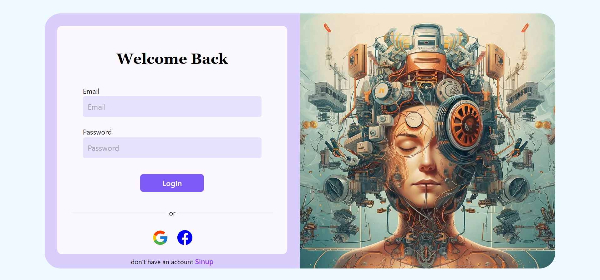

# Image2Story

Image2Story is an application that translates images to text using a model from Hugging Face and then generates a story based on the extracted text using the OpenAI API. The images uploaded by users are stored in Firebase, and the app is built with React, Langchain.js for llm interaction, and styled with Tailwind CSS.

# To learn More about the project visit the below google Slide document.

https://docs.google.com/presentation/d/1UWUpS05VgiOmsnyFFP9J7F0ruV1tDlrLJh-h5OAF-II/edit?usp=sharing

## Overview

The project aims to provide users with a creative and interactive way to transform images into narrative stories.

## Technologies Used

- [Hugging Face Model for Image to Text Translation](https://huggingface.co/models)
- [OpenAI API for Story Generation](https://beta.openai.com/)
- [Firebase](https://firebase.google.com/) for image storage
- [Langchain.js](https://github.com/langchain/langchain) for language processing
- [React](https://reactjs.org/) for the frontend
- [Tailwind CSS](https://tailwindcss.com/) for styling

## How it Works

Users upload images, which are translated into text using the Hugging Face model. The generated text is then sent to the OpenAI API for story generation. The resulting story is displayed to the user.

### Installation

1. Clone the repository:
2. Install dependencies: `npm install`
3. Configure Firebase: Follow the instructions in `firebase.config.js`
4. Configure OpenAI: Add your API key in the appropriate configuration file

## Usage

1. Run the application: `npm start`
2. Upload an image using the provided interface
3. View the generated story based on the image
